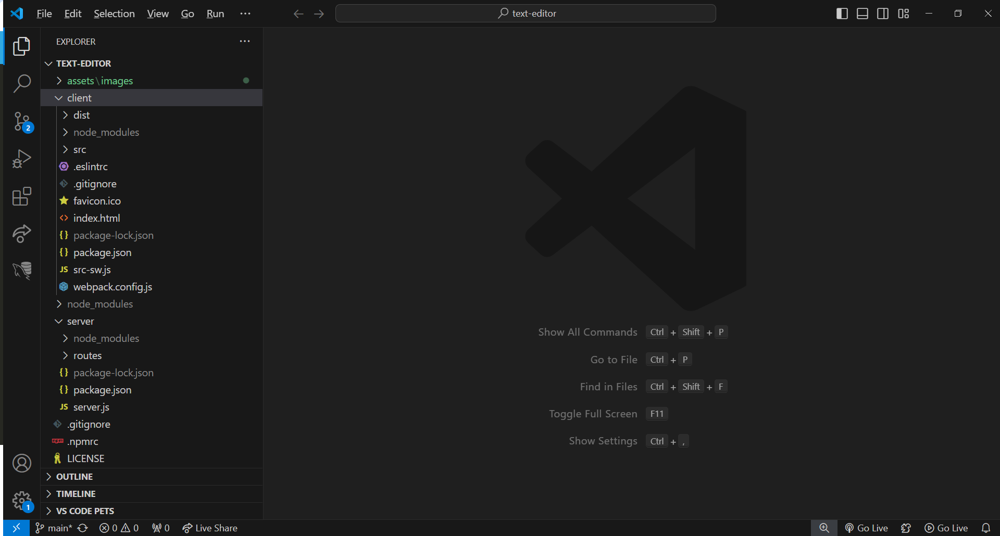
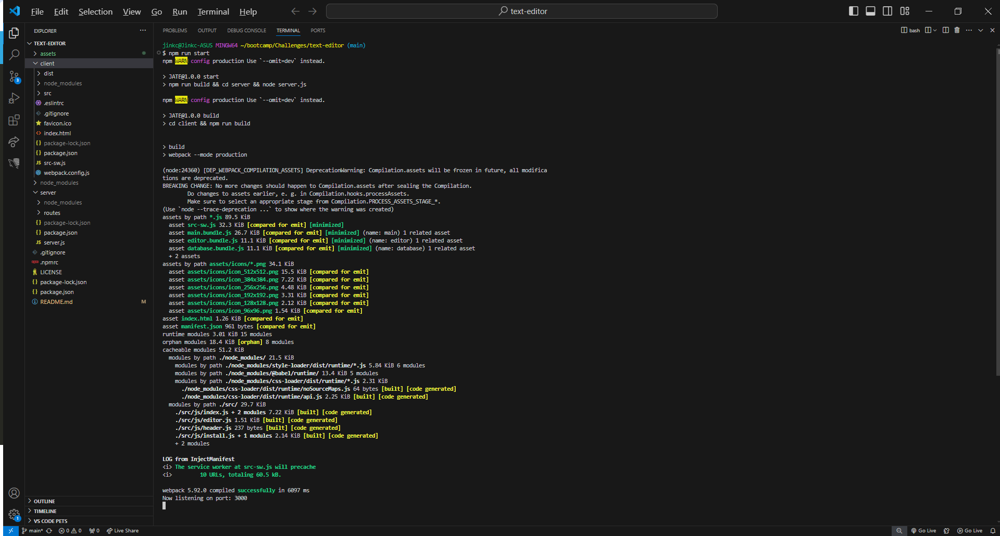
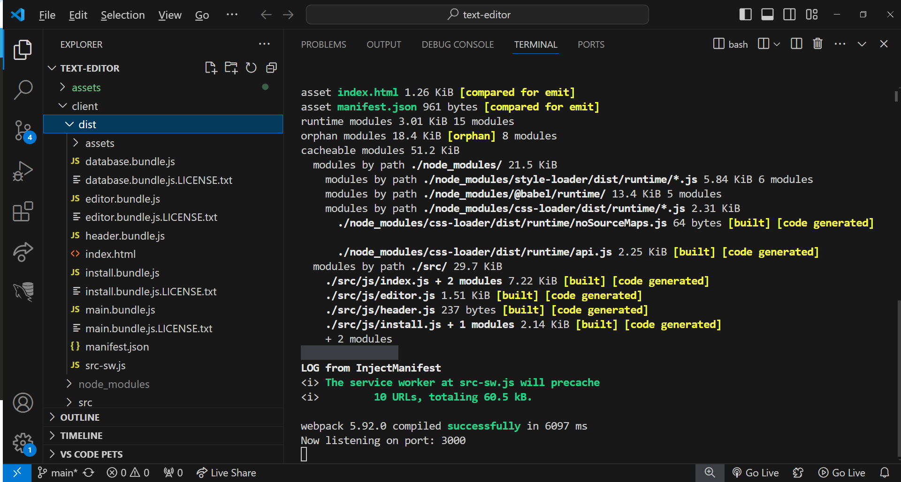
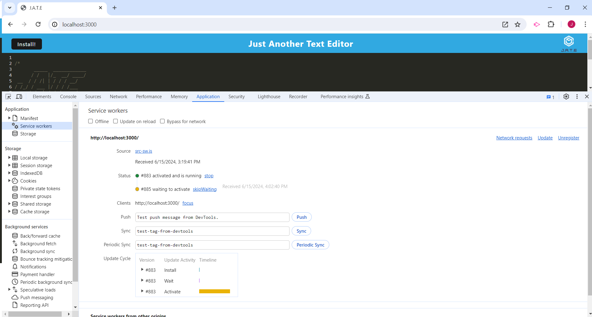
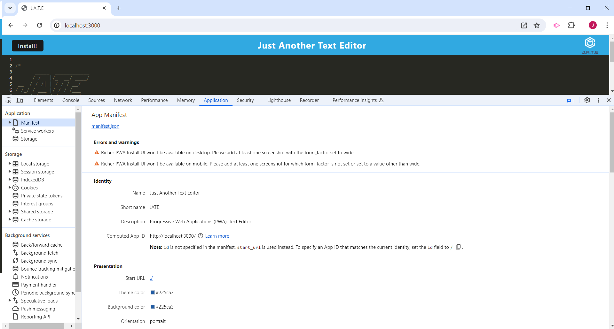
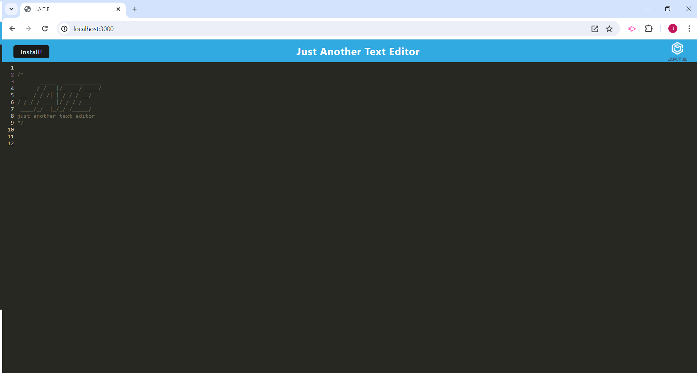
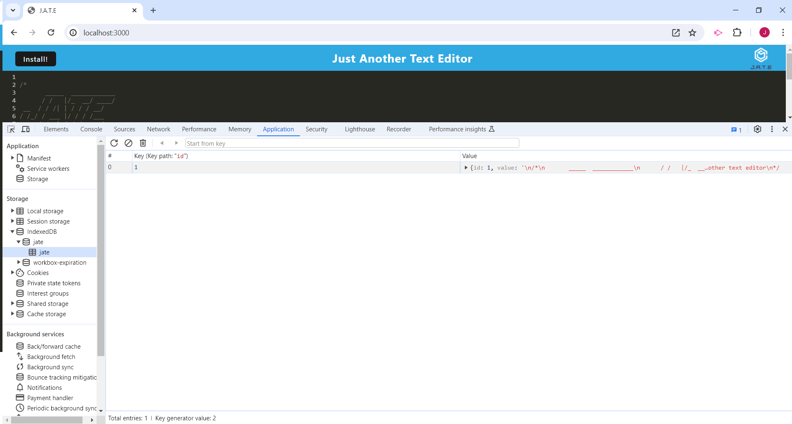
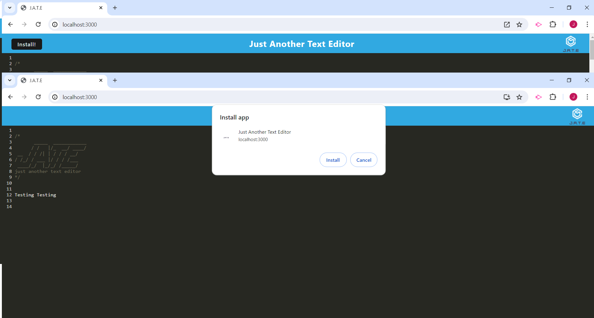
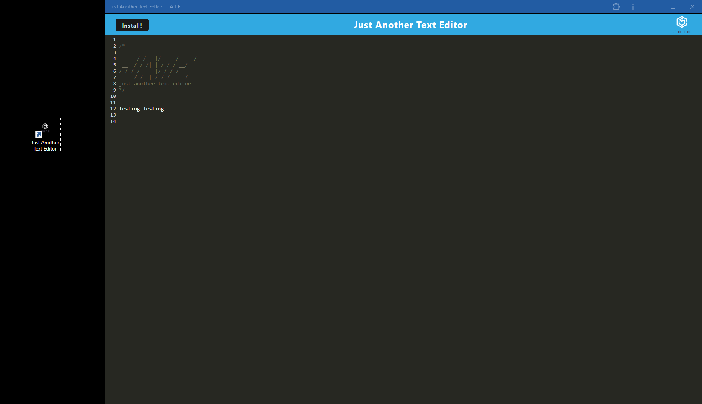

# Text Editor

## Description

 This is a text editor that runs in the browser. The app is a single-page application that meets the PWA criteria. Additionally, it features a number of data persistence techniques that serve as redundancy in case one of the options is not supported by the browser. The application can also function offline.

## Table of Contents (Optional)

- [Installation](#installation)
- [Usage](#usage)
- [Credits](#credits)
- [License](#license)

## Installation

Download repository from https://github.com/jinkc21/text-editor

Download Node.js from https://nodejs.org/en

Once files are downloaded and installed, run the command "npm i" in the integraded terminal of the root folder, client folder, and server folder. This will download all dependencies necessary.

Fully functional text editor can also be accessed at https://text-editor-0sks.onrender.com/

## Usage

This screenshot shows the client server folder structure

To start the program, run the command "npm run start" in the integraded terminal of the root folder. This will generate a HTML file, service worker, and a manifest file then start the server. 

The text editor can be accessed through the browser at http://localhost:3000/

An IndexedDB is created and content is saved to IndexedDB.

When clicking on the "Install" button, the web application is downloaded as an icon on the desktop.

## Credits
Webpack documentation was used to set up the packages and bundles.
https://webpack.js.org/guides/getting-started/

Concurrently was used to run multiple commands.
https://www.npmjs.com/package/concurrently

MDN Web Docs provided documentation for the client-server models.
https://developer.mozilla.org/en-US/docs/Learn/Server-side/First_steps/Client-Server_overview

Workbox documentation helped with generating service worker packages and manifest.
https://developer.chrome.com/docs/workbox/the-ways-of-workbox/#generatesw-vs-injectmanifest
https://developer.chrome.com/docs/workbox/modules/workbox-webpack-plugin#type-GenerateSW
https://developer.chrome.com/docs/workbox/modules/workbox-webpack-plugin/#injectmanifest-plugin

HtmlWebpackPlugin and WebpackPwaManifest were used to create the manifest.
https://github.com/jantimon/html-webpack-plugin
https://www.npmjs.com/package/webpack-pwa-manifest

Render was used to deploy the app.
https://coding-boot-camp.github.io/full-stack/render/render-deployment-guide

## License

MIT License

Copyright (c) 2024 jinkc21

Permission is hereby granted, free of charge, to any person obtaining a copy
of this software and associated documentation files (the "Software"), to deal
in the Software without restriction, including without limitation the rights
to use, copy, modify, merge, publish, distribute, sublicense, and/or sell
copies of the Software, and to permit persons to whom the Software is
furnished to do so, subject to the following conditions:

The above copyright notice and this permission notice shall be included in all
copies or substantial portions of the Software.

THE SOFTWARE IS PROVIDED "AS IS", WITHOUT WARRANTY OF ANY KIND, EXPRESS OR
IMPLIED, INCLUDING BUT NOT LIMITED TO THE WARRANTIES OF MERCHANTABILITY,
FITNESS FOR A PARTICULAR PURPOSE AND NONINFRINGEMENT. IN NO EVENT SHALL THE
AUTHORS OR COPYRIGHT HOLDERS BE LIABLE FOR ANY CLAIM, DAMAGES OR OTHER
LIABILITY, WHETHER IN AN ACTION OF CONTRACT, TORT OR OTHERWISE, ARISING FROM,
OUT OF OR IN CONNECTION WITH THE SOFTWARE OR THE USE OR OTHER DEALINGS IN THE
SOFTWARE.

---